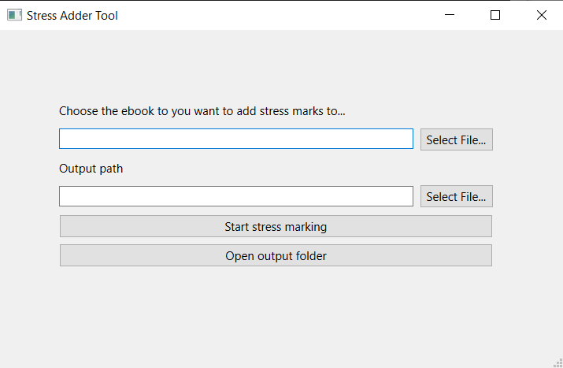
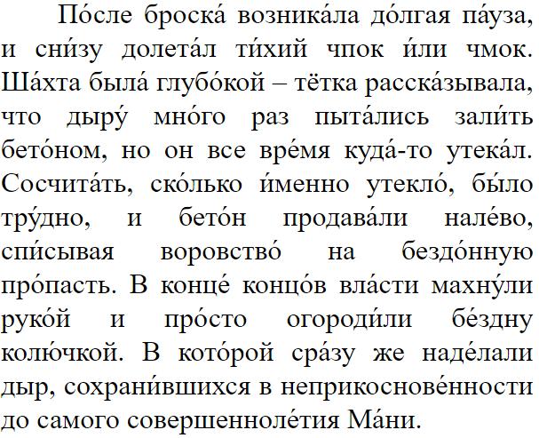

# Russian word stresser for ebooks
[Короткие инструкции на русском](README_RU.md)
<!-- 
-->
<p float="left">
  
   
</p>
(Screenshots of the GUI and a created ebook with stress marks)

(If you want to know how to use this with a dictionary for reading ebooks, [check out my tutorial!](https://github.com/Vuizur/add-stress-to-epub/wiki/How-to-read-books-in-Russian-with-stress-marks-and-interactive-dictionary-lookup))

This program stresses entire Russian ebooks and adds the dots over the ё. It not only is the most sophisticated open source stress detection tool (that I am aware of), it also allows you to convert entire ebooks!

To reach the best results, it analyzes the case and part of speech of every word in order to find the correct stress. So it will stress the word "слова" differently in these two sentences: `В стро́гом смы́сле сло́ва?` vs. `Твои́ слова́ ничего́ не зна́чат.`

Also check out my dictionaries that are compatible with stressed text: [Russian-English](https://github.com/Vuizur/ebook_dictionary_creator/releases/download/v1.0.0/Russian-English.Stardict.zip) and [Russian-Russian](https://github.com/Vuizur/ruwiktionary-htmldump-parser/releases/download/v1.0.0/Russian-Russian-dict.zip) (both are in Stardict format and work well with programs such as KOReader).

### Installation

**For windows**, you simply need to download the [executable release](https://github.com/Vuizur/add-stress-to-epub/releases), unpack the .zip file into a folder and start the program called #Stress marker.exe. This opens up a GUI and you can simply select the ebook you want to convert. Click on the "Start stress marking" button to start it all. Txt files are also supported.

(If your ebook is not in the epub or txt format, you need to install [Calibre](https://calibre-ebook.com/). If you have it installed, the script will automatically convert the book (for example from FB2) to epub)

I did not create executables for Linux or Mac, for these systems you should refer to the steps under "Command line use"

### Command line use

You can install the package by running `pip install git+https://github.com/Vuizur/add-stress-to-epub` and then use the library programmatically.

Other option: download the Github repository (click the Code -> Download ZIP button) and put the dictionary zip file into this folder.

Afterwards should install [Python 3](https://www.python.org/downloads/) (and check the installer option to add it to PATH). Afterwards install the required libraries by executing following command in the command line (which can be opened in Windows Explorer through the "File" button at the top left and then selecting "Open Windows Powershell"): Then install [poetry](https://github.com/python-poetry/poetry) and run:

```
poetry install
```

Then you can simply execute the GUI by calling:

```
poetry shell
pip install PyQt6
poetry run python russian_text_stresser/gui.py
```

If you want to use the command line utility, you should put you ebook in this folder and start the program with following command (and change input.epub to the file name of the ebook you want to convert):

```
poetry run python edit_epub.py -input "input.epub" -output "output.epub"
```

That's it!

You can also convert entire folders filled with epub files:
```
poetry run python edit_epub.py -input_folder "to-convert" -output_folder "was-converted"
```

### Programmatic usage
If you want to stress text in python, you can simply write:

```
from russian_text_stresser.text_stresser import RussianTextStresser

ts = RussianTextStresser()
print(ts.stress_text("Твои слова ничего не значат."))
```
This will print `Твои́ слова́ ничего́ не зна́чат.`

### Feedback

If you have feedback or suggestions, please tell me. I have only tested it for some ebooks, so there could be bugs left. If you find a word that is being stressed incorrectly or if a word is on (English) Wiktionary but still not being stressed, then open an issue. I will maybe maintain a list of words that confuse the algorithm (pretty rare but happens), so that there is rather no stress than a wrong one.

If you are interested in modifying the program: The database used in this project has been created using my other project here: https://github.com/Vuizur/ebook_dictionary_creator 

### Limitations
In some cases the stress is omitted because there are multiple options the word could be stressed depending on the context (in the case of замок or все vs всё) or because they don't appear in my current data source, which can be the case for very rare words. Or the grammatical analysis delivered wrong results, which can also happen in rare cases.

### FAQ
**Q**: The accents don't get correctly displayed in KOReader, the accented letters are way too small or the accent mark is slightly misplaced. What can I do?

**A**: It's best to disable "Embedded Fonts" in this case. Open the menu by clicking somewhere at the top, then in the menu at the bottom of the page select the settings wheel symbol on the rightmost side. Set here "Embedded Fonts" to "off".

### Benchmark results

#### Setting stress:

| System                         |   % Correct |   % Unstressed |   % Incorrect |   Correct / incorrect |
|:-------------------------------|------------:|---------------:|--------------:|----------------------:|
| Reynolds                       |       90.14 |           8.82 |          1.04 |                 86.94 |
| Russtress                      |       83.84 |          11.71 |          4.45 |                 18.83 |
| Russtress-f                    |       93.39 |           1.13 |          5.48 |                 17.03 |
| Random                         |       58.66 |           0.00 |         41.34 |                  1.42 |
| RussianGram                    |       94.59 |           3.71 |          1.71 |                 55.40 |
| Russ                           |       85.52 |           0.00 |         14.48 |                  5.90 |
| Our system                     |       93.11 |           5.85 |          1.04 |                 89.80 |
| Our system + Russtress-f       |       95.91 |           2.53 |          1.57 |                 61.23 |
| Our system + WSD               |       94.62 |           4.09 |          1.29 |                 73.19 |
| Our system + WSD + Russtress-f |       95.83 |           2.51 |          1.65 |                 57.92 |

#### Yofication + setting stress:
| System      |   % Correct |   % Unstressed |   % Incorrect |   Correct / incorrect |
|:------------|------------:|---------------:|--------------:|----------------------:|
| Our system  |       92.64 |           5.85 |          1.52 |                 61.03 |
| Reynolds    |       89.67 |           8.83 |          1.50 |                 59.60 |
| RussianGram |       94.36 |           3.62 |          2.02 |                 46.80 |

### Thesis

You can read my thesis about Russian text stressing [here](https://github.com/Vuizur/add-stress-to-epub/releases/download/v1.0.1/Masterarbeit.pdf)

Cite as:
```
@mastersthesis{krumbiegel2023,
  author = {Krumbiegel, Hannes},
  title = {Automated detection of word stress in Russian texts},
  school = {TU Bergakademie Freiberg},
  year = {2023},
  month = {September},
  type = {Master's thesis}
}
```

### Acknowledgements
The data is sourced from the English Wiktionary, the SQLite database containing it has been constructed on the base of Tatu Ylonen's parsed Wiktionary that can be found kaikki.org. An additional data source is the OpenRussian project, the Russian Wiktionary and Wikipedia.


### Similar projects

* Russiangram/Morpher(https://russiangram.com/, https://morpher.ru/accentizer/), closed source and connected to a paid program, also performs a grammatical analysis, I don't know if it also uses Wiktionary or another data source. I did not benchmark mine thoroughly against it, but in some cases mine seems to give better results, for example when копье is in prepositional case or also for the word дверном. Maybe Russiangram has a larger vocabulary though.

* Someone who implemented a similar program (without grammar analysis), but never published it: https://www.reddit.com/r/russian/comments/8akdm4/reading_and_the_problem_of_stress/ 
